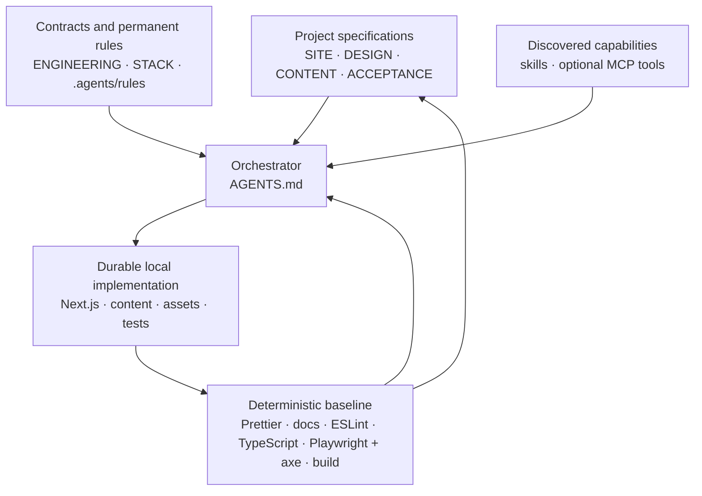

# Showcase Website Factory

A lean production master for distinctive, high-end portfolio and showcase websites. Copy it, complete four project specifications, add approved assets, and start one short prompt. The agent then plans, implements, inspects, refines, tests, and validates the website against an explicit completion contract.

> **Reuse infrastructure and behavior. Recreate visual identity per project.**

The factory standardizes orchestration, engineering quality, responsive and accessibility review, motion discipline, browser verification, and evidence. It deliberately does not standardize hero layouts, page compositions, brand colors, typography, section designs, visual motifs, or project-specific choreography.

## System model



[`AGENTS.md`](AGENTS.md) is the definitive orchestrator. [`RUNBOOK.md`](docs/system/RUNBOOK.md) defines the autonomous phase order. [`TOOLING.md`](docs/system/TOOLING.md) routes capabilities and fallbacks.

## Precise terminology

- **Project specifications** are [`SITE.md`](docs/project/SITE.md), [`DESIGN.md`](docs/project/DESIGN.md), [`CONTENT.md`](docs/project/CONTENT.md), and [`ACCEPTANCE.md`](docs/project/ACCEPTANCE.md). They define one showcase.
- **Repository rules** in [`.agents/rules/`](.agents/rules/code-quality.md) are permanent constraints. They apply throughout a run and are not optional skills.
- **Skills** are instruction packages discovered and read in the current agent environment. They provide methods and expertise, not external access.
- **MCP servers and external tools** are optional runtime capabilities for external data, applications, or interaction. They are not skills, npm packages, or final-site dependencies.
- **Local tooling** is the repository-owned deterministic QA baseline and remains available without optional MCP access.

Authority is resolved in this order: direct user instructions; the relevant project specification; repository engineering and stack contracts; repository rules; applicable skills; MCP or external recommendations; general agent defaults. Domain ownership is strict: `SITE.md` owns scope and behavior, `DESIGN.md` owns visual and motion direction, `CONTENT.md` owns copy and content, and `ACCEPTANCE.md` owns completion checks without adding scope.

## Source of truth

| Decision                                                                           | Authoritative source                                                  |
| ---------------------------------------------------------------------------------- | --------------------------------------------------------------------- |
| Scope, routes, sections, behavior, and non-goals                                   | [`SITE.md`](docs/project/SITE.md)                                     |
| Visual identity, typography, layout, imagery, responsive art direction, and motion | [`DESIGN.md`](docs/project/DESIGN.md)                                 |
| Approved copy, products, projects, content data, and media assignments             | [`CONTENT.md`](docs/project/CONTENT.md)                               |
| Completion and verification, without product-scope expansion                       | [`ACCEPTANCE.md`](docs/project/ACCEPTANCE.md)                         |
| Architecture, data flow, accessibility, performance, and code quality              | [`ENGINEERING.md`](docs/system/ENGINEERING.md)                        |
| Default, opt-in, and excluded technology                                           | [`STACK.md`](docs/system/STACK.md) and [`package.json`](package.json) |
| Skill discovery, MCP routing, fallbacks, commands, and evidence                    | [`TOOLING.md`](docs/system/TOOLING.md)                                |
| Autonomous phase order, execution modes, entry points, and launch prompts          | [`RUNBOOK.md`](docs/system/RUNBOOK.md)                                |
| Reading order, authority hierarchy, preflight, restrictions, and completion gate   | [`AGENTS.md`](AGENTS.md)                                              |
| Permanent concise constraints                                                      | [`.agents/rules/`](.agents/rules/code-quality.md)                     |
| QA output                                                                          | Local command output and [`artifacts/qa/`](artifacts/qa/README.md)    |

Files under [`docs/superpowers/`](docs/superpowers/README.md) are implementation history, not current authority and not mandatory runtime reading.

## Start a new showcase

1. Copy this repository without generated folders such as `node_modules`, `.next`, or generated `artifacts/qa` output. Do not create an extra nested app directory.
2. Run `pnpm install --frozen-lockfile` and, if needed, `pnpm exec playwright install chromium`.
3. Complete these files in order:
   1. [`SITE.md`](docs/project/SITE.md)
   2. [`DESIGN.md`](docs/project/DESIGN.md)
   3. [`CONTENT.md`](docs/project/CONTENT.md)
   4. [`ACCEPTANCE.md`](docs/project/ACCEPTANCE.md)
4. Remove every `[REQUIRED: replace before production run]` marker and set all four specifications to `READY`.
5. Add stable production media under [`public/media/`](public/media/README.md), reference notes under [`references/`](references/README.md), and only deliberately bounded concept work under [`concepts/`](concepts/README.md).
6. Start the appropriate prompt below. The agent follows `AGENTS.md`, performs its capability preflight, selects the smallest useful discovered capability set, and continues through `pnpm qa`.

`TEMPLATE_NOT_CONFIGURED` is intentional in the untouched factory and does not fail the base repository's QA. A configured production project may not retain required markers.

## Direct Build and Concept Sprint

Use **Direct Build** when all four project specifications are complete, consistent, and `READY`. The agent may interpret and refine inside the specified direction but must not replace it.

Use **Concept Sprint** only when visual direction, information architecture, or signature interactions are intentionally unresolved. It may use discovered design skills and optional design MCP tools to compare a small number of bounded options. The selected decisions must update, or be proposed as explicit updates to, the owning project specifications before final Direct Build begins. A normal `/goal` must not quietly become an uncontrolled redesign.

## Reusable run prompts

These prompts are also stored in [`RUNBOOK.md`](docs/system/RUNBOOK.md).

### Normal Antigravity showcase run

```text
/goal

Execute the complete Showcase Website Factory Direct Build defined in AGENTS.md.

Read and follow all referenced project and system documents. Perform the capability preflight, then continue autonomously through planning, implementation, motion, responsive refinement, accessibility, browser and visual QA, bug fixing and final validation.

Do not stop until the project acceptance criteria pass and pnpm qa succeeds, unless a genuine blocker requires user input.
```

### Antigravity Teamwork run

```text
/teamwork-preview

Execute the complete Showcase Website Factory workflow defined in AGENTS.md.

Use teamwork only for genuinely independent workstreams. Ensure every agent follows the same project specifications, authority hierarchy and design direction. Reconcile all work through the lead agent.

Continue through implementation, motion, responsive refinement, accessibility, browser and visual QA, bug fixing and final validation. Do not stop until the project acceptance criteria pass and pnpm qa succeeds, unless a genuine blocker requires user input.
```

### Codex or another agent without slash commands

```text
Execute the complete Showcase Website Factory Direct Build defined in AGENTS.md for the project in docs/project/.

Perform the capability preflight and continue autonomously until all acceptance criteria pass and pnpm qa succeeds. Do not commit, push or deploy.
```

Antigravity may support the two slash commands. Codex and other agents without them should receive the equivalent text as a normal task prompt. Claude-compatible environments may use [`CLAUDE.md`](CLAUDE.md) as a bridge where that convention is supported; do not assume automatic loading. Every entry point must ultimately instruct the agent to follow `AGENTS.md`.

## When Teamwork is appropriate

Use `/goal` for a normal three-to-six-page showcase. Reserve `/teamwork-preview` for genuinely independent workstreams such as separate reference and asset research, several complex page families, unusually elaborate motion, an independent accessibility or performance audit, or a major hero portfolio piece.

Every teammate must share the same project specifications, authority hierarchy, and design direction. Give streams clear ownership and reconcile all work through the lead agent before final QA; teammates must not invent competing visual directions independently.

## Assets and references

- Store final production media locally under [`public/media/`](public/media/README.md) and record assignment, source, rights, alt text, focal point, and responsive crop in `CONTENT.md`.
- Store references and their decision notes under [`references/`](references/README.md). References are inspiration, not production assets to copy.
- Use search or generation only when the project specifications permit it. Do not leave a finished site dependent on temporary MCP output URLs.
- Keep rejected or exploratory directions under [`concepts/`](concepts/README.md) only while they remain useful.

## Development and deterministic QA

```bash
pnpm dev
pnpm qa
```

Focused commands:

```bash
pnpm format:check
pnpm docs:check
pnpm lint
pnpm typecheck
pnpm test:e2e
pnpm test:e2e:ui
pnpm build
```

Playwright is always-required automated baseline QA, not merely an MCP fallback. It uses an isolated local server on port 3100, reads routes from [`tests/e2e/routes.ts`](tests/e2e/routes.ts), checks browser/runtime health, overflow, and serious or critical axe findings, and records screenshots at 320×568, 390×844, 768×1024, 1440×1000, and 1920×1080. Axe does not replace keyboard, focus, contrast, touch, or interaction reasoning. A discovered browser MCP may add exploratory and visual verification; documented manual review is the last fallback when interactive automation is unavailable.

Generated evidence is described in [`artifacts/qa/README.md`](artifacts/qa/README.md). Screenshot generation alone is not visual review.

## Maintain the master template

Move an improvement back into the master only when it improves reusable infrastructure or behavior without importing a project's visible identity. Good candidates include a clearer acceptance check, safer accessibility behavior, a leaner test, or a current framework convention. Do not backport a hero, section composition, palette, type pairing, motion signature, copy model, or one-project dependency.

Keep the master small enough to understand in a short review. Do not add a component generator, custom CLI, schema-driven page builder, universal section registry, plugin framework, custom design DSL, CMS/database abstraction, large token framework, or preset theme.

## Upgrade dependencies safely

1. Check current official release, migration, peer-compatibility, and security notes.
2. Update exact versions in [`package.json`](package.json); avoid ranges.
3. Run `pnpm install` and review lockfile and configuration changes.
4. Run `pnpm qa` and inspect browser screenshots.
5. Update [`STACK.md`](docs/system/STACK.md) only when roles, constraints, or important conventions changed.

Do not assume a previous Next.js, React, Tailwind, ESLint, TypeScript, Motion, or Playwright convention remains current.
