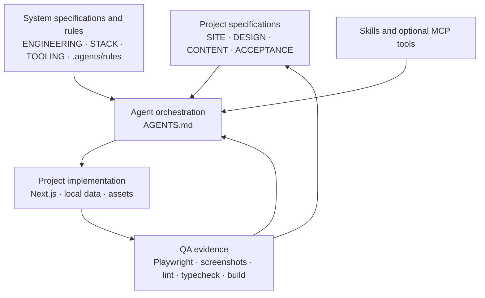

# Showcase Website Factory

A lean production master for building distinctive, high-end portfolio and showcase websites with Next.js. Copy it, replace the project specifications, add approved assets, and let an agent implement, browser-test, refine, and validate the finished 3–6 page showcase against an explicit completion contract.

> **Reuse infrastructure and behavior. Recreate visual identity per project.**

The master standardizes workflow, engineering quality, accessibility, responsive QA, motion discipline, browser verification, and evidence. It deliberately does not standardize hero layouts, page compositions, brand colors, typography, section designs, visual motifs, or project-specific choreography.

## How the system connects



[`AGENTS.md`](AGENTS.md) controls the loop. [`docs/project/`](docs/project/SITE.md) describes the current showcase. [`docs/system/`](docs/system/ENGINEERING.md) holds stable production decisions. [Repository rules](.agents/rules/code-quality.md) are short non-negotiable constraints. Skills and optional MCP tools add phase-specific expertise. [`ACCEPTANCE.md`](docs/project/ACCEPTANCE.md) says when work is finished; browser and command evidence proves it.

## Source of truth

| Decision                                                            | Authoritative source                                                  |
| ------------------------------------------------------------------- | --------------------------------------------------------------------- |
| Purpose, scope, routes, journeys, and behavior                      | [`SITE.md`](docs/project/SITE.md)                                     |
| Visual thesis, responsive art direction, and motion personality     | [`DESIGN.md`](docs/project/DESIGN.md)                                 |
| Approved copy, entities, contact details, and media assignments     | [`CONTENT.md`](docs/project/CONTENT.md)                               |
| Definition of Done and required evidence                            | [`ACCEPTANCE.md`](docs/project/ACCEPTANCE.md)                         |
| Architecture, data flow, accessibility, performance, and clean code | [`ENGINEERING.md`](docs/system/ENGINEERING.md)                        |
| Default, opt-in, and excluded technology                            | [`STACK.md`](docs/system/STACK.md) and [`package.json`](package.json) |
| Skill/MCP routing, autonomous modes, commands, and evidence paths   | [`TOOLING.md`](docs/system/TOOLING.md)                                |
| Agent reading order, authority hierarchy, and execution loop        | [`AGENTS.md`](AGENTS.md)                                              |
| Concise non-negotiable constraints                                  | [`.agents/rules/`](.agents/rules/code-quality.md)                     |
| Verification output                                                 | Local command output and [`artifacts/qa/`](artifacts/qa/README.md)    |

## Responsibility matrix

| Responsibility   | Owner                                                                  | Verified by                                         |
| ---------------- | ---------------------------------------------------------------------- | --------------------------------------------------- |
| Scope            | User/project author through `SITE.md`                                  | Route and interaction tests plus acceptance review  |
| Visual direction | User/creative direction through `DESIGN.md`                            | Viewport screenshots and visual-cohesion review     |
| Content          | Project author through `CONTENT.md`                                    | Page review, metadata checks, and asset assignments |
| Architecture     | `ENGINEERING.md` and `STACK.md`                                        | Lint, typecheck, build, and code review             |
| Tool selection   | `TOOLING.md`, constrained by the active agent environment              | Tool output and documented fallback                 |
| Completion       | `ACCEPTANCE.md`                                                        | Item-by-item evidence report                        |
| Evidence         | Playwright, accessibility checks, screenshots, and validation commands | Fresh local output; never an unsupported claim      |

## What is stable and what changes

Stable across copies:

- agent workflow and authority rules
- App Router engineering and data-flow constraints
- dependency selection principles
- accessibility, responsive, motion, and clean-code rules
- practical Playwright route, console, overflow, accessibility, and screenshot coverage
- validation commands and evidence locations

Replace for every showcase:

- the four files in [`docs/project/`](docs/project/SITE.md)
- all visible UI and project-specific components
- typography, colors, image grammar, tokens, spacing rhythm, and motion language
- content data and local media
- `tests/e2e/routes.ts` and project-specific interaction checks

The included page is only a neutral status screen. It is not a starter design and should be removed when the project is configured.

## Start a new showcase

1. Copy this repository without generated folders such as `node_modules`, `.next`, and generated `artifacts/qa` output. Do not create an extra nested app directory.
2. Run `pnpm install --frozen-lockfile`.
3. If necessary, install the scoped browser with `pnpm exec playwright install chromium`.
4. Complete, in order:
   1. [`SITE.md`](docs/project/SITE.md)
   2. [`DESIGN.md`](docs/project/DESIGN.md)
   3. [`CONTENT.md`](docs/project/CONTENT.md)
   4. [`ACCEPTANCE.md`](docs/project/ACCEPTANCE.md)
5. Remove every `[REQUIRED: replace before production run]` marker and set all four status fields to `READY`.
6. Add stable production media under [`public/media/`](public/media/README.md), inspiration under [`references/`](references/README.md), and optional limited concept work under [`concepts/`](concepts/README.md).
7. Replace the template-status UI, add typed local data under [`src/data/`](src/data/README.md), and update `tests/e2e/routes.ts`.
8. Start a Direct Build with the reusable `/goal` in [`TOOLING.md`](docs/system/TOOLING.md).

## Direct Build

Use Direct Build when the four project documents are complete, consistent, `READY`, and visually locked. The agent follows [`AGENTS.md`](AGENTS.md), implements the full site, performs separate motion/accessibility/polish passes, inspects required viewports, and stops only at the acceptance contract or a genuine external blocker.

## Concept Sprint

Use a Concept Sprint when the visual thesis is still uncertain. Explore only two or three bounded directions: hero, navigation, one representative section, one product/project treatment, and rough motion. Select a direction, move its decisions into [`DESIGN.md`](docs/project/DESIGN.md), and only then begin Direct Build. A concept prototype must not become a silent production dependency.

## Assets and references

- Put production media in [`public/media/`](public/media/README.md) with stable local assignments in [`CONTENT.md`](docs/project/CONTENT.md).
- Put reference screenshots and notes in [`references/`](references/README.md). References are inspiration, not source assets to copy.
- Record source, license/rights, aspect ratio, focal point, alt text, intended use, and mobile crop for production assets.
- Keep rejected or exploratory directions in [`concepts/`](concepts/README.md) only while they remain useful.

## Development and QA

```bash
pnpm dev
pnpm qa
```

Useful focused commands:

```bash
pnpm format:check
pnpm docs:check
pnpm lint
pnpm typecheck
pnpm test:e2e
pnpm test:e2e:ui
pnpm build
```

Playwright uses a project-isolated QA server on port 3100. The default route registry is [`tests/e2e/routes.ts`](tests/e2e/routes.ts). The suite runs practical mobile and desktop health checks and captures review screenshots at 320×568, 390×844, 768×1024, 1440×1000, and 1920×1080. Generated evidence is described in [`artifacts/qa/README.md`](artifacts/qa/README.md).

`TEMPLATE_NOT_CONFIGURED` is intentional in the untouched factory and does not fail its own QA. A configured production project may not retain required markers.

## When Teamwork is appropriate

Normal 3–6 page showcases should use one autonomous `/goal`. Consider `/teamwork-preview` only for genuinely independent workstreams such as extensive asset research, advanced 3D, unusually complex motion, a large route count, an important hero exploration, or a separate deep QA stream. Details are in [`TOOLING.md`](docs/system/TOOLING.md).

## Maintain the master template

Move an improvement back into the master only when it improves reusable infrastructure or behavior without importing a project’s visible identity. Good candidates include a clearer acceptance check, safer accessibility behavior, a leaner test, or a current framework convention. Do not backport a hero, section composition, palette, type pairing, motion signature, copy model, or a dependency used by only one showcase.

Keep the master small enough to understand in a short review. Do not add a component generator, custom CLI, schema-driven page builder, universal section registry, plugin framework, custom design DSL, CMS/database abstraction, large token framework, or preset theme.

## Upgrade dependencies safely

1. Check current official release, migration, peer-compatibility, and security notes.
2. Update exact versions in [`package.json`](package.json); avoid ranges.
3. Run `pnpm install` and `pnpm peers check`.
4. Review lockfile and configuration changes.
5. Run `pnpm qa` and inspect browser screenshots.
6. Update [`STACK.md`](docs/system/STACK.md) only when roles, constraints, or important conventions changed.

Do not assume a previous Next.js, React, Tailwind, ESLint, TypeScript, Motion, or Playwright convention remains current.
